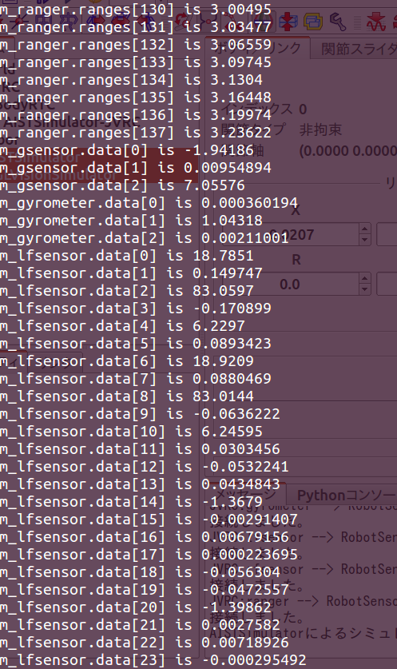

センサの接続
============

ここではJVRCモデルに搭載された各種センサのデータを取得できるようにします。

プロジェクトを開く
------------------

「メニュー」の「プロジェクトの読み込み」から JVRC モデルファイル用のプロジェク トファイルを読み込みます。プロジェクトファイル名は「モデルファイルのインス トール」でダウンロードしたリポジトリの「model/robot/samples/sample1.cnoid」です。

JVRC モデルのセンサ
-------------------

JVRC モデルに搭載されているセンサは、テキストエディタでリポジトリの「model/robot/main.wrl」ファイルを開くと確認することができます。
モデルファイルを開くと次のように記述されており、加速度センサ gsensor とジャイロセンサ gyrometer が搭載されていることがわかります。 ::

   DEF JVRC Humanoid {
     humanoidBody [
       DEF PELVIS Joint {
         jointType "free"
         translation 0 0 0.854
         children [
           DEF PELVIS_S Segment {
   	  mass 10
   	  centerOfMass -0.01 0 0.034
   	  momentsOfInertia [0.08958333333333333 0 0 0 0.08958333333333333 0 0 0 0.11249999999999999]
   	  children [
               DEF gsensor AccelerationSensor {
                 sensorId 0
               }
               DEF gyrometer Gyro {
                 sensorId 0
               }
   	    Inline { url "pelvis.wrl" }
   	  ]
   	}

他にも、力センサ rfsensor, lfsensorが搭載されていることが分かります。 ::

   				DEF rfsensor ForceSensor {
   				  sensorId 0
   				}

   				DEF lfsensor ForceSensor {
   				  sensorId 1
   				}

カメラ rcamera, lcamera、距離センサ ranger も確認することができます。 ::

   			    DEF NECK_P Joint {
   			      jointType "rotate"
   			      jointAxis "Y"
   			      jointId 17
   			      ulimit [1.0471975511965976] #+60
   			      llimit [-0.8726646259971648] #-50
   			      uvlimit [ 5.75958]
   			      lvlimit [-5.75958]
   			      rotorInertia 0.0596
   			      children [
   			        DEF NECK_P_S Segment {
   				  mass 2
   				  centerOfMass 0.01 0 0.11
   				  momentsOfInertia [0.00968 0 0 0 0.00968 0 0 0 0.00968]
   				  children [
   				    Inline { url "head.wrl" }
   				  ]
   				}
   				DEF rcamera VisionSensor {
   				  translation 0.1 -0.03 0.09
   				  rotation      0.4472 -0.4472 -0.7746 1.8235
   				  frontClipDistance 0.05
   				  width 640
   				  height 480
   				  type "COLOR"
   				  sensorId 0
   				  fieldOfView 1.0
   				} 
   				DEF lcamera VisionSensor {
   				  translation 0.1 0.03 0.09
   				  rotation      0.4472 -0.4472 -0.7746 1.8235
   				  frontClipDistance 0.05
   				  width 640
   				  height 480
   				  type "COLOR"
   				  sensorId 1
   				  fieldOfView 1.0
   				} 
   				DEF ranger RangeSensor {
   				  translation 0.1 0.0 0.0
   				  rotation      0.4472 -0.4472 -0.7746 1.8235
   				  sensorId 0
   				  scanAngle 1.5707963267948966
   				  scanStep 0.011344640137963142
   				  scanRate 100
   				  minDistance 0.1
   				  maxDistance 30.0
   				} 
   			      ]
   			    } # NECK_P

各センサの仕様について解説します。
おおまかな仕様はこちらで確認することができますが、記述がかなり古く不正確です。

http://www.openrtp.jp/openhrp3/jp/controller_bridge.html

加速度センサの値は要素数3のTimedDoubleSeq型になります。それぞれの方向の関節角度の二回微分(加速度)が格納されています。

ジャイロセンサの値は要素数3のTimedDoubleSeq型になります。三次元ベクトルのジャイロ(角速度)が格納されています。

力センサの値は要素数24のTimedDoubleSeq型になります。3次元ベクトルの力と3次元ベクトルのトルクが格納されています。

カメラの値はImg::TimedCameraImage型になります。

https://github.com/s-nakaoka/choreonoid/blob/master/src/OpenRTMPlugin/corba/CameraImage.idl

Img::TimedCameraImageの型の定義は以下のようになっています。 ::

   enum ColorFormat
   {
     CF_UNKNOWN, CF_GRAY, CF_RGB,
     CF_GRAY_JPEG, CF_RGB_JPEG // local extension
   };

   struct ImageData
   {
     long width;
     long height;
     ColorFormat format;
     sequence<octet> raw_data;
   };

   struct CameraImage
   {
     RTC::Time captured_time;
     ImageData image;
     CameraIntrinsicParameter intrinsic;
     Mat44 extrinsic;
   };
   struct TimedCameraImage
   {
     RTC::Time tm;
     CameraImage data;
     long error_code;
   };

width x heightの各ピクセルの色情報が1ピクセル当たりformatとしてdata.image.raw_date部分に格納されます。
今回のカメラの場合、width = 640, height = 480と定義されているので、640x480のデータとなります。

距離センサの値はRangeData型になります。 ::

    typedef sequence<double> RangeList;
    struct RangeData
    {
        /// Time stamp.
        Time tm;
        /// Range values in metres.
        RangeList ranges;
        /// Geometry of the ranger at the time the scan data was measured.
        RangerGeometry geometry;
        /// Configuration of the ranger at the time the scan data was measured.
        RangerConfig config;
    };

シーケンスに計測方向に向かって右からスキャンした距離データが格納されています。
距離の値は何かに干渉が発生する限り出力されますが、干渉がない場合は0になります。 ::

コントローラのソースコード
--------------------------

コントローラのヘッダのソースコードは以下になります。Choreonoidに含まれるサンプルのSR1WalkControllerRTC.hを基にしています。 ::

   /**
      Sample Robot motion controller for the JVRC robot model.
      This program was ported from the "SR1WalkControllerRTC.h" sample of Choreonoid.
   */
   
   #ifndef RobotSensorsControllerRTC_H
   #define RobotSensorsControllerRTC_H
   
   #include <rtm/idl/BasicDataTypeSkel.h>
   #include <rtm/idl/ExtendedDataTypes.hh>
   #include <rtm/idl/InterfaceDataTypes.hh>
   #include <rtm/Manager.h>
   #include <rtm/DataFlowComponentBase.h>
   #include <rtm/CorbaPort.h>
   #include <rtm/DataInPort.h>
   #include <rtm/DataOutPort.h>
   #include <cnoid/MultiValueSeq>
   // #include <cnoid/corba/CameraImage.hh>
   
   class RobotSensorsControllerRTC : public RTC::DataFlowComponentBase
   {
   public:
       RobotSensorsControllerRTC(RTC::Manager* manager);
       ~RobotSensorsControllerRTC();
   
       virtual RTC::ReturnCode_t onInitialize();
       virtual RTC::ReturnCode_t onActivated(RTC::UniqueId ec_id);
       virtual RTC::ReturnCode_t onDeactivated(RTC::UniqueId ec_id);
       virtual RTC::ReturnCode_t onExecute(RTC::UniqueId ec_id);
   
   protected:
       // DataInPort declaration
       RTC::TimedDoubleSeq m_angle;
       RTC::InPort<RTC::TimedDoubleSeq> m_angleIn;
       RTC::TimedDoubleSeq m_gsensor;
       RTC::InPort<RTC::TimedDoubleSeq> m_gsensorIn;
       RTC::TimedDoubleSeq m_gyrometer;
       RTC::InPort<RTC::TimedDoubleSeq> m_gyrometerIn;
       RTC::TimedDoubleSeq m_lfsensor;
       RTC::InPort<RTC::TimedDoubleSeq> m_lfsensorIn;
       RTC::TimedDoubleSeq m_rfsensor;
       RTC::InPort<RTC::TimedDoubleSeq> m_rfsensorIn;
       // Img::TimedCameraImage m_lcamera;
       // RTC::InPort m_lcameraIn;
       // Img::TimedCameraImage m_rcamera;
       // RTC::InPort m_rcameraIn;
       RTC::RangeData m_ranger;
       RTC::InPort<RTC::RangeData> m_rangerIn;
   };
   
   extern "C"
   {
       DLL_EXPORT void RobotSensorsControllerRTCInit(RTC::Manager* manager);
   };
   
   #endif

コントローラのソースコードは以下になります。Choreonoidに含まれるサンプルのSR1WalkControllerRTC.cppを基にしています。 ::

   /**
      Sample Robot motion controller for the JVRC robot model.
      This program was ported from the "SR1WalkControllerRTC.cpp" sample of
      Choreonoid.
   */
   
   #include "RobotSensorsControllerRTC.h"
   #include <cnoid/BodyMotion>
   #include <cnoid/ExecutablePath>
   #include <cnoid/FileUtil>
   #include <iostream>
   
   using namespace std;
   using namespace cnoid;
   
   namespace {
   
   const char* samplepd_spec[] =
   {
       "implementation_id", "RobotSensorsControllerRTC",
       "type_name",         "RobotSensorsControllerRTC",
       "description",       "Robot Controller component",
       "version",           "0.1",
       "vendor",            "AIST",
       "category",          "Generic",
       "activity_type",     "DataFlowComponent",
       "max_instance",      "10",
       "language",          "C++",
       "lang_type",         "compile",
       ""
   };
   }
   
   
   RobotSensorsControllerRTC::RobotSensorsControllerRTC(RTC::Manager* manager)
       : RTC::DataFlowComponentBase(manager),
         m_angleIn("q", m_angle),
         m_gsensorIn("gsensor", m_gsensor),
         m_gyrometerIn("gyrometer", m_gyrometer),
         m_lfsensorIn("lfsensor", m_lfsensor),
         m_rfsensorIn("rfsensor", m_rfsensor),
         m_rangerIn("ranger", m_ranger)
         // m_lcameraIn("lcamera", m_lcamera),
         // m_rcameraIn("rcamera", m_rcamera),
         // m_rangerIn("ranger", m_ranger)
   {
   
   }
   
   RobotSensorsControllerRTC::~RobotSensorsControllerRTC()
   {
   
   }
   
   
   RTC::ReturnCode_t RobotSensorsControllerRTC::onInitialize()
   {
       // Set InPort buffers
       addInPort("q", m_angleIn);
       addInPort("gsensor", m_gsensorIn);
       addInPort("gyrometer", m_gyrometerIn);
       addInPort("lfsensor", m_lfsensorIn);
       addInPort("rfsensor", m_rfsensorIn);
       // addInPort("lcamera", m_lcameraIn);
       // addInPort("rcamera", m_rcameraIn);
       addInPort("ranger", m_rangerIn);
   
       cout << "hoge" << endl;
   
       return RTC::RTC_OK;
   }
   
   RTC::ReturnCode_t RobotSensorsControllerRTC::onActivated(RTC::UniqueId ec_id)
   {
       return RTC::RTC_OK;
   }
   
   
   RTC::ReturnCode_t RobotSensorsControllerRTC::onDeactivated(RTC::UniqueId ec_id)
   {
       return RTC::RTC_OK;
   }
   
   RTC::ReturnCode_t RobotSensorsControllerRTC::onExecute(RTC::UniqueId ec_id)
   {
       if(m_angleIn.isNew()){
               m_angleIn.read();
       }
   
       for(size_t i=0; i < m_angle.data.length(); ++i){
               // cout << "m_angle.data[" << i << "] is " << m_angle.data[i] << std::endl;
       }
   
       if(m_gsensorIn.isNew()){
               m_gsensorIn.read();
       }
   
       for(size_t i=0; i < m_gsensor.data.length(); ++i){
               cout << "m_gsensor.data[" << i << "] is " << m_gsensor.data[i] << std::endl;
       }
   
       if(m_gyrometerIn.isNew()){
               m_gyrometerIn.read();
       }
   
       for(size_t i=0; i < m_gyrometer.data.length(); ++i){
               cout << "m_gyrometer.data[" << i << "] is " << m_gyrometer.data[i] << std::endl;
       }
   
       if(m_lfsensorIn.isNew()){
               m_lfsensorIn.read();
       }
   
       for(size_t i=0; i < m_lfsensor.data.length(); ++i){
               cout << "m_lfsensorIn.data[" << i << "] is " << m_lfsensor.data[i] << std::endl;
       }
   
       if(m_rfsensorIn.isNew()){
               m_rfsensorIn.read();
       }
   
       for(size_t i=0; i < m_rfsensor.data.length(); ++i){
               cout << "m_rfsensorIn.data[" << i << "] is " << m_rfsensor.data[i] << std::endl;
       }
   
       // if(m_lcameraIn.isNew()){
       //     m_lcameraIn.read();
       // }
       //
       // for(size_t i=0; i < m_lcamera.data.image.raw_data.length(); ++i){
       //         cout << "m_lcameraIn.data.image.raw_data[" << i <<
       //                 "] is " << m_lcamera.data.image.raw_data[i] << std::endl;
       // }
       //
       // if(m_rcameraIn.isNew()){
       //     m_rcameraIn.read();
       // }
       //
       // for(size_t i=0; i < m_rcamera.data.image.raw_data.length(); ++i){
       //         cout << "m_rcameraIn.data.image.raw_data[" << i <<
       //                 "] is " << m_rcamera.data.image.raw_data[i] << std::endl;
       // }
   
       if(m_rangerIn.isNew()){
               m_rangerIn.read();
       }
   
       for(size_t i=0; i < m_ranger.ranges.length(); ++i){
               cout << "m_rangerIn.ranges[" << i << "] is " << m_ranger.ranges[i] << std::endl;
       }
       return RTC::RTC_OK;
   }
   
   
   extern "C"
   {
       DLL_EXPORT void RobotSensorsControllerRTCInit(RTC::Manager* manager)
       {
           coil::Properties profile(samplepd_spec);
           manager->registerFactory(profile,
                                    RTC::Create<RobotSensorsControllerRTC>,
                                    RTC::Delete<RobotSensorsControllerRTC>);
       }
   };

行っている処理については、「RTコンポーネントのコントローラの接続」とほとんど同じで、センサが増えただけです。
ただし、それぞれのセンサの型は異なるので注意してください。

これらのソースコードは「モデルファイルのインストール」でダウンロードしたリポジトリの「model/robot/RTC/RobotSensorsControllerRTC.cpp」と「model/robot/RTC/RobotSensorsControllerRTC.h」に保存されています。

RTCの設定ファイル
-----------------

これまではChoreonoidの自動設定の機能を用いてRTCのポートを生成していました。
しかし、これはサンプル実行用のもので、単純なRTCのポート定義にしか使えません。

今回のロボット用のRTCは複雑なので、設定ファイルを用いて各種ポートを定義する必要があります。次のような設定ファイルを用意し、ファイル名を「RobotSensorsJVRC.conf」とします。これを「model/robot/RTC/」ディレクトリに置くとコントローラのビルド後のインストール作業においてインストールされます。 ::

   out-port = q:JOINT_VALUE
   out-port = gsensor:ACCELERATION_SENSOR
   out-port = gyrometer:RATE_GYRO_SENSOR
   out-port = lfsensor:FORCE_SENSOR
   out-port = rfsensor:FORCE_SENSOR
   out-port = ranger:RANGE_SENSOR
   connection = q:RobotSensorsControllerRTC0:q
   connection = gsensor:RobotSensorsControllerRTC0:gsensor
   connection = gyrometer:RobotSensorsControllerRTC0:gyrometer
   connection = lfsensor:RobotSensorsControllerRTC0:lfsensor
   connection = rfsensor:RobotSensorsControllerRTC0:rfsensor
   connection = ranger:RobotSensorsControllerRTC0:ranger

out-portとは、RTCの出力ポートの定義です。「ポート名：型」の形式で定義します。

これがin-portになると入力ポートの定義となります。今回はトルクの計算がないため使用していません。

connectionとはRTCのポート接続の設定となります。例えば、「q:RobotSensorsControllerRTC0:q」とはこのRTCのポートqとRobotSensorsControllerRTC0コントローラとの接続設定になります。

ちなみに、コントローラのポート設定に関しては、コントローラのソースコード中で動的に生成と設定がされるので設定ファイルを用いる必要はありません。

この設定ファイルの仕様は OpenHRP3 をベースにしているので以下を参考にしてください。
ただし、下記の資料は記述が古いです。

http://www.openrtp.jp/openhrp3/jp/controller_bridge.html

コントローラのビルド
--------------------

「モデルファイルのインストール」でダウンロードしたリポジトリの「model/robot/RTC/」ディレクトリに移動し、次のコマンドを実行します。 ::

   make

これにより、「model/robot/RTC/」ディレクトリに「RobotSensorsControllerRTC.so」というファイルが作成されるはずです。

その後、次のコマンドを実行します。 ::

   sudo make install DESTDIR=/usr

ChoreonoidではRTCの設定ファイルはChoreonoidのインストール先の共有ディレクトリ(/usr/lib/choreonoid-1.5/rtc)に配置しなければなりません。"make install"ではこの処理を自動的に行ってくれます。

コントローラの設定
------------------

アイテムビューで「BodyRTC」を選択し、プロパティビューの「コントローラのモジュール名」を「RobotSensorsControllerRTC」とします。これは「コントローラのビルド」で作成したモジュールのパスと対応しています。
更に、「設定モード」を「設定ファイルを使用」にし、「設定ファイル名」を「RobotSensorsJVRC.conf」とします。

カメラ、距離センサの有効化
--------------------------

シミュレーションにおいてカメラや距離センサを有効にするため、以下の作業を行います。

アイテムビューで「AISTSimulator」を選択し、「新規」より「GL視覚センサシミュレータ」を選択し、「GLVisionSimulator」という名前で追加します。

.. image:: images/vision.png

「GLVisionSimulator」を選択し、プロパティを以下のように変更します。

「対象ボディ」を「JVRC」

「対象センサ」を「ranger」

.. image:: images/vision_property.png

シミュレーションを実行する
--------------------------

シミュレーションツールバーの「シミュレーション開始ボタン」を押します。
シミュレーションを実行するとchoreonoidを実行している端末にセンサの値が出力されています。
「RTコンポーネントのコントローラの接続」のときとは違い、関節角度(m_angle)だけではなく、 加速度センサ(m_gsensor)、ジャイロセンサ(m_gyrometer)、……の値が表示されるはずです。

サンプルプロジェクトについて
----------------------------

このサンプルのプロジェクトファイルは「モデルファイルのインストール」でダウンロードしたリポジトリの「model/robot/samples/sample4.cnoid」に保存されています。

.. toctree::
   :maxdepth: 2

