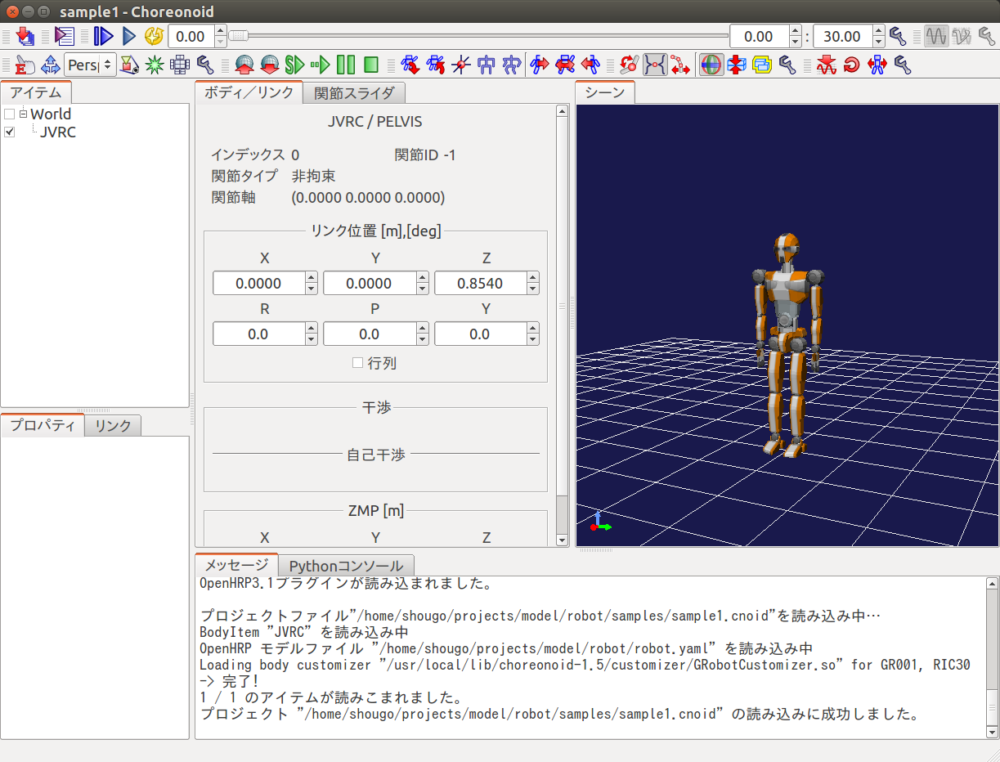

シミュレーションの実行
======================

本ドキュメントではサンプルシミュレーションの実行方法について解説します。

Choreonoidの実行
----------------

まずはChoreonoidを実行します。端末を開いて以下のコマンドを実行してください。 ::

 choreonoid

以下のような画面が表示されるはずです。

.. image:: images/choreonoid.png

モデルを開く
------------

まず、「メニュー」の「ファイル」「新規」より「ワールド」を選択し、ワールドアイ
テム「World」を追加します。

そのまま「メニュー」の「ファイル」「読み込み」より「OpenHRP モデルファイル」を
選択し、JVRC モデルファイルを読み込みます。ファイル名は「モデルファイルのインス
トール」でダウンロードしたリポジトリの「model/robot/robot.yaml」です。

モデルを読み込んだだけではロボットは表示されません。
「アイテム」と書かれたリストのJVRCにチェックを入れてください。
すると、以下のようにロボットが表示されるはずです。

床を追加する
------------

シミュレーションを行うために、床(地面)を追加します。

Choreonoid の画面にはアイテムと表示されている領域がありますが、これをアイテムビューと呼びます。
まずアイテムビューで「World」を選択します。
次に、「メニュー」の「ファイル」「読み込み」より「OpenHRP モデルファイル」を
選択し、床のモデルファイルを開きます。ファイル名は
「/usr/share/choreonoid-1.5/model/misc/floor.wrl」です。

シミュレータアイテムを追加する
------------------------------

アイテムビューで「World」を選択します。
次に、「メニュー」の「ファイル」「新規」より「AISTシミュレータ」を選択し、AISTシミュレータ
「AISTSimulator」を追加します。

.. image:: images/aist_simulator.png

シミュレーションを実行する
--------------------------

次に、シミュレーションツールバーの「シミュレーション開始ボタン」を押します。 こ
れにより、画面上でモデルのシミュレーションが開始されます。

シミュレーションを実行すると下の画像のようにロボットはすぐに崩れ落ちてしまうはずです。

.. image:: images/simulation_no_controller.png

これは全く制御をしていないためです。
これからロボットを制御するプログラムを記述し、ロボットが崩れ落ちないようにして
いきます。

プロジェクトの保存
------------------

シミュレーションの実行が終わったら、プロジェクトを保存しておきましょう。
「ファイル」の「名前を付けてプロジェクトを保存」を選択し、適当なファイル名を付
けて保存します。

サンプルプロジェクトについて
----------------------------

このサンプルのプロジェクトファイルは「モデルファイルのインストール」でダウン
ロードしたリポジトリの「model/robot/samples/sample1.cnoid」に保存されています。

.. toctree::
   :maxdepth: 2

