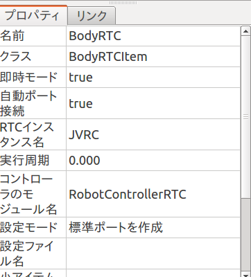
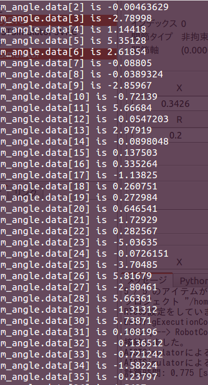

RTコンポーネントのコントローラの接続
=====================================

ここではJVRCモデルにRTコンポーネントのコントローラを接続し、ロボットの関節角度を取得できるようにします。

プロジェクトを開く
------------------

「メニュー」の「プロジェクトの読み込み」からJVRCモデルファイル用のプロジェクトファイルを読み込みます。プロジェクトファイル名は「モデルファイルのインストール」でダウンロードしたリポジトリの「model/robot/samples/sample1.cnoid」です。

コントローラの追加
------------------

まずアイテムビューで「JVRC」を選択します。
次に、「メニュー」の「ファイル」「新規」より「BodyRTC」を選択し「BodyRTC」という名前で追加します。

コントローラのソースコード
--------------------------

コントローラのヘッダのソースコードは以下になります。Choreonoidに含まれるサンプルのSR1WalkControllerRTC.hを基にしています。 ::

   /**
      Sample Robot motion controller for the JVRC robot model.
      This program was ported from the "SR1WalkControllerRTC.h" sample of Choreonoid.
   */
   
   #ifndef RobotControllerRTC_H
   #define RobotControllerRTC_H
   
   #include <rtm/idl/BasicDataTypeSkel.h>
   #include <rtm/Manager.h>
   #include <rtm/DataFlowComponentBase.h>
   #include <rtm/CorbaPort.h>
   #include <rtm/DataInPort.h>
   #include <rtm/DataOutPort.h>
   #include <cnoid/MultiValueSeq>
   
   class RobotControllerRTC : public RTC::DataFlowComponentBase
   {
   public:
       RobotControllerRTC(RTC::Manager* manager);
       ~RobotControllerRTC();
   
       virtual RTC::ReturnCode_t onInitialize();
       virtual RTC::ReturnCode_t onActivated(RTC::UniqueId ec_id);
       virtual RTC::ReturnCode_t onDeactivated(RTC::UniqueId ec_id);
       virtual RTC::ReturnCode_t onExecute(RTC::UniqueId ec_id);
   
   protected:
       // DataInPort declaration
       RTC::TimedDoubleSeq m_angle;
       RTC::InPort<RTC::TimedDoubleSeq> m_angleIn;
   };
   
   extern "C"
   {
       DLL_EXPORT void RobotControllerRTCInit(RTC::Manager* manager);
   };
   
   #endif

`RTC::TimedDoubleSeq` というのは、時刻情報とdouble型の実際の値を持つOpenRTM固有の複合型です。
SeqはOpenRTMにおける配列型のように扱います。
OpenRTMにおけるdouble[]型と考えておけばよいでしょう。

`RTC::InPort<RTC::TimedDoubleSeq>` はRTCの入力ポートを表す型であり、入力ポートを操作するにはこれを利用します。
m_angleは入力ポートから関節角度を受けとるための変数です。m_angleInで取得した値はm_angleで参照します。

コントローラのソースコードは以下になります。Choreonoidに含まれるサンプルのSR1WalkControllerRTC.cppを基にしています。 ::

   /**
      Sample Robot motion controller for the JVRC robot model.
      This program was ported from the "SR1WalkControllerRTC.cpp" sample of
      Choreonoid.
   */
   
   #include "RobotControllerRTC.h"
   #include <cnoid/BodyMotion>
   #include <cnoid/ExecutablePath>
   #include <cnoid/FileUtil>
   #include <iostream>
   
   using namespace std;
   using namespace cnoid;
   
   namespace {
   
   const char* samplepd_spec[] =
   {
       "implementation_id", "RobotControllerRTC",
       "type_name",         "RobotControllerRTC",
       "description",       "Robot Controller component",
       "version",           "0.1",
       "vendor",            "AIST",
       "category",          "Generic",
       "activity_type",     "DataFlowComponent",
       "max_instance",      "10",
       "language",          "C++",
       "lang_type",         "compile",
       ""
   };
   }
   
   
   RobotControllerRTC::RobotControllerRTC(RTC::Manager* manager)
       : RTC::DataFlowComponentBase(manager),
         m_angleIn("q", m_angle)
   {
   
   }
   
   RobotControllerRTC::~RobotControllerRTC()
   {
   
   }
   
   
   RTC::ReturnCode_t RobotControllerRTC::onInitialize()
   {
       // Set InPort buffers
       addInPort("q", m_angleIn);
   
       return RTC::RTC_OK;
   }
   
   RTC::ReturnCode_t RobotControllerRTC::onActivated(RTC::UniqueId ec_id)
   {
       return RTC::RTC_OK;
   }
   
   
   RTC::ReturnCode_t RobotControllerRTC::onDeactivated(RTC::UniqueId ec_id)
   {
       return RTC::RTC_OK;
   }
   
   RTC::ReturnCode_t RobotControllerRTC::onExecute(RTC::UniqueId ec_id)
   {
       if(m_angleIn.isNew()){
           m_angleIn.read();
       }
   
       for(size_t i=0; i < m_angle.data.length(); ++i){
               cout << "m_angle.data[" << i << "] is " << m_angle.data[i] << std::endl;
       }
   
       return RTC::RTC_OK;
   }
   
   
   extern "C"
   {
       DLL_EXPORT void RobotControllerRTCInit(RTC::Manager* manager)
       {
           coil::Properties profile(samplepd_spec);
           manager->registerFactory(profile,
                                    RTC::Create<RobotControllerRTC>,
                                    RTC::Delete<RobotControllerRTC>);
       }
   };

RobotControllerRTCのコンストラクタで、 m_angleIn と m_angle を関連付けています。

RTCの初期化時に呼ばれるonInitialize()で、m_angleInをRTCの入力ポートqと関連づけています。

onExecute()はRTCの実行中に定期的に呼ばれます。ここでは関節角度を取得し標準出力に表示する処理を行っています。
m_angleIn.isNew()とは新しいデータが到着しているか確認する関数です。
onExecute()の実行時にはデータが到着しているかどうかが分からないので、ここでチェックしています。新しいデータが来ていた場合にはm_angleIn.read()でデータを読み込みます。読み込んだデータは自動的にm_angleに格納され、m_angle.dataとして取得できます。
m_angle.dataは各関節毎に配列の値となっています。

これらのソースコードは「モデルファイルのインストール」でダウンロードしたリポジトリの「model/robot/RTC/RobotControllerRTC.cpp」と「model/robot/RTC/RobotControllerRTC.h」に保存されています。

コントローラの設定
------------------

プロジェクト上でRTコンポーネント(RTC)を作成しただけでは、ロボットの制御を行うことができません。

アイテムビューで「BodyRTC」を選択するとプロパティのタブ(プロパティビューと言います)にRTCの設定が表示されます。
プロパティビューの「コントローラのモジュール名」を「RobotControllerRTC」とします。これは「コントローラのビルド」で作成したモジュールのパスと対応しています。
さらに、プロパティビューの「自動ポート接続」を true にします。

コントローラのビルド
--------------------

「モデルファイルのインストール」でダウンロードしたリポジトリの「model/robot/RTC/」ディレクトリに移動し、次のコマンドを実行します。 ::

   make

これにより、「model/robot/RTC/」ディレクトリに「RobotControllerRTC.so」というファイルが作成されるはずです。

その後、次のコマンドを実行します。 ::

   sudo make install DESTDIR=/usr

Choreonoidでは読み込むRTCコントローラのモジュールはChoreonoidのインストール先の共有ディレクトリ(/usr/lib/choreonoid-1.5/rtc)に配置しなければなりません。"make install"ではこの処理を自動的に行ってくれます。

シミュレーションを実行する
--------------------------

シミュレーションツールバーの「シミュレーション開始ボタン」を押します。
シミュレーションを実行するとchoreonoidを実行している端末に関節角度(m_angle)の値が表示されるはずです。

このようにして得られる関節角度を基にトルクをロボットに入力することでロボットの制御を行うことができます。この後のサンプルで詳しく解説します。

サンプルプロジェクトについて
----------------------------

このサンプルのプロジェクトファイルは「モデルファイルのインストール」でダウンロードしたリポジトリの「model/robot/samples/sample2.cnoid」に保存されています。

.. toctree::
   :maxdepth: 2

