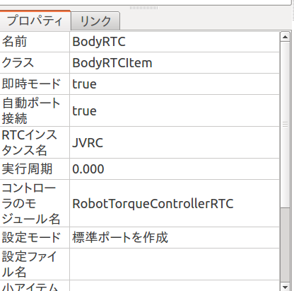
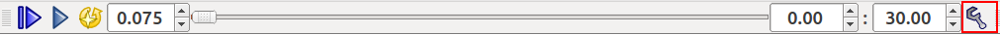
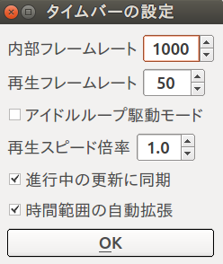
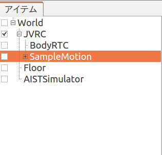
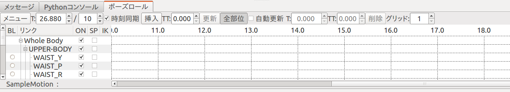
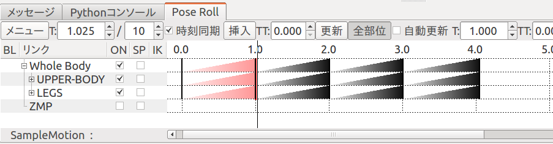
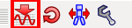
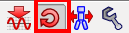
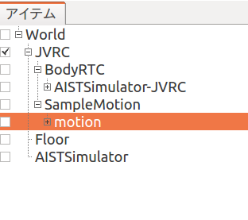
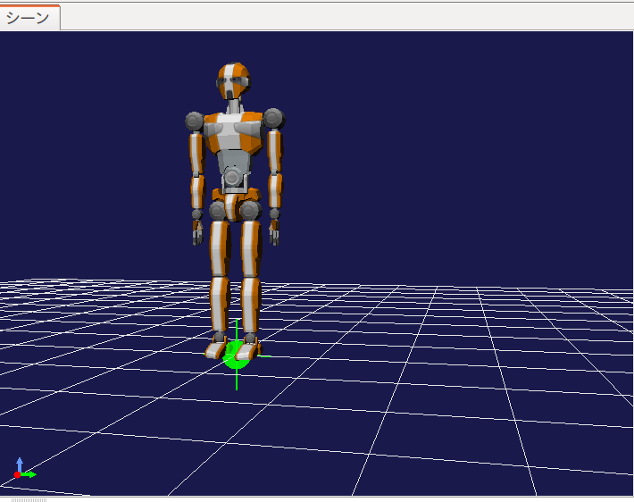

RTコンポーネントにおけるトルク指令の入力
========================================

ここでは、トルク指令を出力するようにRTコンポーネントを拡張し、ロボットが直立を
維持できるようにします。

プロジェクトを開く
------------------

「メニュー」の「プロジェクトの読み込み」から JVRC モデルファイル用のプロジェク
トファイルを読み込みます。プロジェクトファイル名は「モデルファイルのインス
トール」でダウンロードしたリポジトリの「model/robot/samples/sample2.cnoid」です。

コントローラのソースコード
--------------------------

コントローラのヘッダのソースコードは以下になります。Choreonoidに含まれるサンプルのSR1WalkControllerRTC.hを基にしています。 ::

   /**
      Sample Robot motion controller for the JVRC robot model.
      This program was ported from the "RobotTorqueController.h" sample of Choreonoid.
   */
   
   #ifndef RobotTorqueControllerRTC_H
   #define RobotTorqueControllerRTC_H
   
   #include <rtm/idl/BasicDataTypeSkel.h>
   #include <rtm/Manager.h>
   #include <rtm/DataFlowComponentBase.h>
   #include <rtm/CorbaPort.h>
   #include <rtm/DataInPort.h>
   #include <rtm/DataOutPort.h>
   #include <cnoid/MultiValueSeq>
   #include <vector>
   
   class RobotTorqueControllerRTC : public RTC::DataFlowComponentBase
   {
   public:
       RobotTorqueControllerRTC(RTC::Manager* manager);
       ~RobotTorqueControllerRTC();
   
       virtual RTC::ReturnCode_t onInitialize();
       virtual RTC::ReturnCode_t onActivated(RTC::UniqueId ec_id);
       virtual RTC::ReturnCode_t onDeactivated(RTC::UniqueId ec_id);
       virtual RTC::ReturnCode_t onExecute(RTC::UniqueId ec_id);
   
   protected:
       // DataInPort declaration
       RTC::TimedDoubleSeq m_angle;
       RTC::InPort<RTC::TimedDoubleSeq> m_angleIn;
   
       // DataOutPort declaration
       RTC::TimedDoubleSeq m_torque;
       RTC::OutPort<RTC::TimedDoubleSeq> m_torqueOut;
   
   private:
       cnoid::MultiValueSeqPtr qseq;
       std::vector<double> q0;
       cnoid::MultiValueSeq::Frame oldFrame;
       int currentFrame;
       double timeStep_;
   };
   
   extern "C"
   {
       DLL_EXPORT void RobotTorqueControllerRTCInit(RTC::Manager* manager);
   };
   
   #endif

今回はトルクの出力をしなければならないので、出力ポートのための設定が増加しています。
`RTC::OutPort<RTC::TimedDoubleSeq>` はRTCの出力ポートを表す型であり、出力ポートを操作するにはこれを利用します。

コントローラのソースコードは以下になります。Choreonoidに含まれるサンプルのSR1WalkControllerRTC.cppを基にしています。 ::

   /**
      Sample Robot motion controller for the JVRC robot model.
      This program was ported from the "SR1WalkControllerRTC.cpp" sample of
      Choreonoid.
   */
   
   #include "RobotTorqueControllerRTC.h"
   #include <cnoid/BodyMotion>
   #include <cnoid/ExecutablePath>
   #include <cnoid/FileUtil>
   
   using namespace std;
   using namespace cnoid;
   
   namespace {
   
   static const double pgain[] = {
       50000.0, 30000.0, 30000.0, 30000.0, 30000.0,
       80000.0, 80000.0, 10000.0, 3000.0, 30000.0,
       30000.0, 80000.0, 3000.0, 30000.0, 10000.0,
       3000.0, 3000.0, 30000.0, 30000.0, 10000.0,
       3000.0, 30000.0, 3000.0, 3000.0, 3000.0,
       3000.0, 3000.0, 3000.0, 3000.0, 3000.0,
       3000.0, 3000.0, 10000.0, 3000.0, 3000.0,
       30000.0, 3000.0, 3000.0, 3000.0, 3000.0,
       3000.0, 3000.0, 3000.0, 3000.0,
       };
   
   static const double dgain[] = {
       100.0, 100.0, 100.0, 100.0, 100.0,
       100.0, 100.0, 100.0, 100.0, 100.0,
       100.0, 100.0, 100.0, 100.0, 100.0,
       100.0, 100.0, 100.0, 100.0, 100.0,
       100.0, 100.0, 100.0, 100.0, 100.0,
       100.0, 100.0, 100.0, 100.0, 100.0,
       100.0, 100.0, 100.0, 100.0, 100.0,
       100.0, 100.0, 100.0, 100.0, 100.0,
       100.0, 100.0, 100.0, 100.0,
       };
   
   const char* samplepd_spec[] =
   {
       "implementation_id", "RobotTorqueControllerRTC",
       "type_name",         "RobotTorqueControllerRTC",
       "description",       "Robot TorqueController component",
       "version",           "0.1",
       "vendor",            "AIST",
       "category",          "Generic",
       "activity_type",     "DataFlowComponent",
       "max_instance",      "10",
       "language",          "C++",
       "lang_type",         "compile",
       ""
   };
   }
   
   
   RobotTorqueControllerRTC::RobotTorqueControllerRTC(RTC::Manager* manager)
       : RTC::DataFlowComponentBase(manager),
         m_angleIn("q", m_angle),
         m_torqueOut("u", m_torque)
   {
   }
   
   RobotTorqueControllerRTC::~RobotTorqueControllerRTC()
   {
   
   }
   
   
   RTC::ReturnCode_t RobotTorqueControllerRTC::onInitialize()
   {
       // Set InPort buffers
       addInPort("q", m_angleIn);
   
       // Set OutPort buffer
       addOutPort("u", m_torqueOut);
   
       return RTC::RTC_OK;
   }
   
   RTC::ReturnCode_t RobotTorqueControllerRTC::onActivated(RTC::UniqueId ec_id)
   {
       if(!qseq){
           string filename = getNativePathString(
               boost::filesystem::path(shareDirectory())
               / "motion" / "RobotPattern.yaml");
   
           BodyMotion motion;
   
           if(!motion.loadStandardYAMLformat(filename)){
               cout << motion.seqMessage() << endl;
               return RTC::RTC_ERROR;
           }
           qseq = motion.jointPosSeq();
           if(qseq->numFrames() == 0){
               cout << "Empty motion data." << endl;
               return RTC::RTC_ERROR;
           }
           q0.resize(qseq->numParts());
           timeStep_ = qseq->getTimeStep();
       }
   
       m_torque.data.length(qseq->numParts());
   
       if(m_angleIn.isNew()){
           m_angleIn.read();
       }
       for(int i=0; i < qseq->numParts(); ++i){
           q0[i] = m_angle.data[i];
       }
       oldFrame = qseq->frame(0);
       currentFrame = 0;
   
       return RTC::RTC_OK;
   }
   
   
   RTC::ReturnCode_t RobotTorqueControllerRTC::onDeactivated(RTC::UniqueId ec_id)
   {
       return RTC::RTC_OK;
   }
   
   RTC::ReturnCode_t RobotTorqueControllerRTC::onExecute(RTC::UniqueId ec_id)
   {
       if(m_angleIn.isNew()){
               m_angleIn.read();
       }
   
       if(currentFrame > qseq->numFrames()){
               m_torqueOut.write();
               return RTC::RTC_OK;
       }
   
       MultiValueSeq::Frame frame = qseq->frame(currentFrame++);
   
       for(int i=0; i < frame.size(); i++){
               double q_ref = frame[i];
               double q = m_angle.data[i];
               double dq_ref = (q_ref - oldFrame[i]) / timeStep_;
               double dq = (q - q0[i]) / timeStep_;
               m_torque.data[i] = (q_ref - q) * pgain[i]/100.0 + (dq_ref - dq) * dgain[i]/100.0;
               q0[i] = q;
   
               cout << "i = " << i << " ";
               cout << "q_ref = " << frame[i] << " ";
               cout << "q = " << q << " ";
               cout << "dq_ref = " << dq_ref << " ";
               cout << "dq = " << dq << " ";
               cout << "torque = " << m_torque.data[i] << endl;
       }
       oldFrame = frame;
   
       m_torqueOut.write();
   
       return RTC::RTC_OK;
   }
   
   
   extern "C"
   {
       DLL_EXPORT void RobotTorqueControllerRTCInit(RTC::Manager* manager)
       {
           coil::Properties profile(samplepd_spec);
           manager->registerFactory(profile,
                                    RTC::Create<RobotTorqueControllerRTC>,
                                    RTC::Delete<RobotTorqueControllerRTC>);
       }
   };

出力ポートに関する設定は、入力ポートの場合と関数名が異なるだけでよく似ています。

onActivated() のときの処理に注目しましょう。この関数はRTCが有効化された際に一度だけ呼ばれます。
ここで、Choreonoidの共有ディレクトリからRobotPattern.yamlを読み出しています。
これは制御の際の基準となるフレームファイルです。 `motion.loadStandardYAMLformat()` によりモーションデータに変換します。
onActivated()では初期値の設定も行っています。

onExecute()ではトルクの計算と出力の処理が追加されました。
関節角度を読み込む部分のコードはこれまでと同じですが、 `m_torque.data[i]` に計算したトルクの値を代入しています。
ここでは簡単なPD制御によりトルクの値を求めています。
各関節毎のPgainとDgainはソースコードの先頭付近に固定値で定義されています。
ロボットがうまく制御できない場合はこの値を調整する必要があります。
`m_torque.data` にセットした値は `m_torqueOut.write()` により実際のロボットの制御トルクとして出力されます。
出力ポートは値をセットするだけなので入力ポートよりも簡単です。

これらのソースコードは 「モデルファイルのインストール」でダウンロードしたリポジトリの「model/robot/RTC/RobotTorqueControllerRTC.cpp」と 「model/robot/RTC/RobotTorqueControllerRTC.h」に保存されています。

コントローラの設定
------------------

アイテムビューで「BodyRTC」を選択し、プロパティビューの「コントローラのモジュール名」を「RobotTorqueControllerRTC」とします。これは「コントローラのビルド」で作成したモジュールのパスと対応しています。
さらに、プロパティビューの「自動ポート接続」を true にします。

シミュレーションの設定
----------------------

Choreonoidにおけるシミュレーションの初期実行間隔は10msとあまりに粗く、今回のロボットの制御には向いていません。
シミュレーションの実行間隔を細かくすることで、
この作業はモーションを生成する前に行う必要があります。

タイムバーの設定画面を開きます。

「内部フレームレート」の項目を下記のように「1000」に設定します。

このフレームレートは1秒間に何回実行するかを表しています。
これが1000で1ミリ秒の間隔となり、100で10ミリ秒間隔となります。

ポーズ列の追加
--------------

まずアイテムビューで「JVRC」を選択します。
次に、「メニュー」の「ファイル」「新規」より「ポーズ列」を選択し「SampleMotion」という名前で追加します。

次に、「表示」の「ビューの表示」から「ポーズロール」を選択します。次の画面が表示されるはずです。

基準の姿勢を作るため、アイテムビューで「JVRC」を選択し、ツールバーにある「選択ボディを初期姿勢に」のボタンを押します。

ポーズロールにおいて、1.0 を選択して「挿入」を押します。
同様に 2.0, 3.0, 4.0 を選択して「挿入」を押します。

ポーズロールは次のようになるはずです。

あとはこれを繰り返し、15.0まで生成します。

ポーズロールで作成したのはキーフレームと呼びます。これより、プログラムで使用するモーションを生成させます。
ツールバーから「ボディモーションの生成」ボタンを押します。

モーションはツールバーのボタンで手動で生成しなくても、キーフレームの更新時に自動生成することができます。
これを有効にするにはツールバーの「自動更新モード」のボタンをオンにしてください。

SampleMotion の子供に motion があるので、これを選択し名前を付けて保存ボタンを押します。

「モデルファイルのインストール」でダウンロードしたリポジトリの「model/robot/RTC/」ディレクトリに「RobotMotion.yaml」というファイルで保存します。

コントローラのビルド
--------------------

「モデルファイルのインストール」でダウンロードしたリポジトリの「model/robot/RTC/」ディレクトリに移動し、次のコマンドを実行します。 ::

   make

これにより、「model/robot/RTC/」ディレクトリに「RobotTorqueControllerRTC.so」というファイルが作成されるはずです。

その後、次のコマンドを実行します。 ::

   sudo make install DESTDIR=/usr

シミュレーションを実行する
--------------------------

シミュレーションツールバーの「シミュレーション開始ボタン」を押します。
シミュレーションを実行すると今度はなかなかロボットが崩れ落ちず、シミュレーション時間で4秒間の間立ったままの状態になったはずです。

pgain, dgain の調整について
---------------------------

ポーズを決めてモーションを生成し、コントローラで読み込んでシミュレーションさせたとしても、うまくロボットは制御できません。
制御がないとロボットは崩れてしまい、制御をやりすぎるとロボットはどこかへ飛んでいってしまいます。
そのため、各関節のpgain, dgainを細かく調整する必要があります。

制御の簡単な方針として、シミュレーション中にトルクや dq の値を表示させ、明らかに変化が激しくなっている関節角度のpgainを増加させます。
またはシミュレーションの描画中に不安定になっている関節の関節番号を確認し、その関節角度のpgainを増加させます。
dgain は少し値を変えただけでロボットが飛んでいくほど影響が大きいので、値の調整は難しいです。

サンプルプロジェクトについて
----------------------------

このサンプルのプロジェクトファイルは「モデルファイルのインストール」でダウン ロードしたリポジトリの「model/robot/samples/sample3.cnoid」に保存されています。

.. toctree::
   :maxdepth: 2

