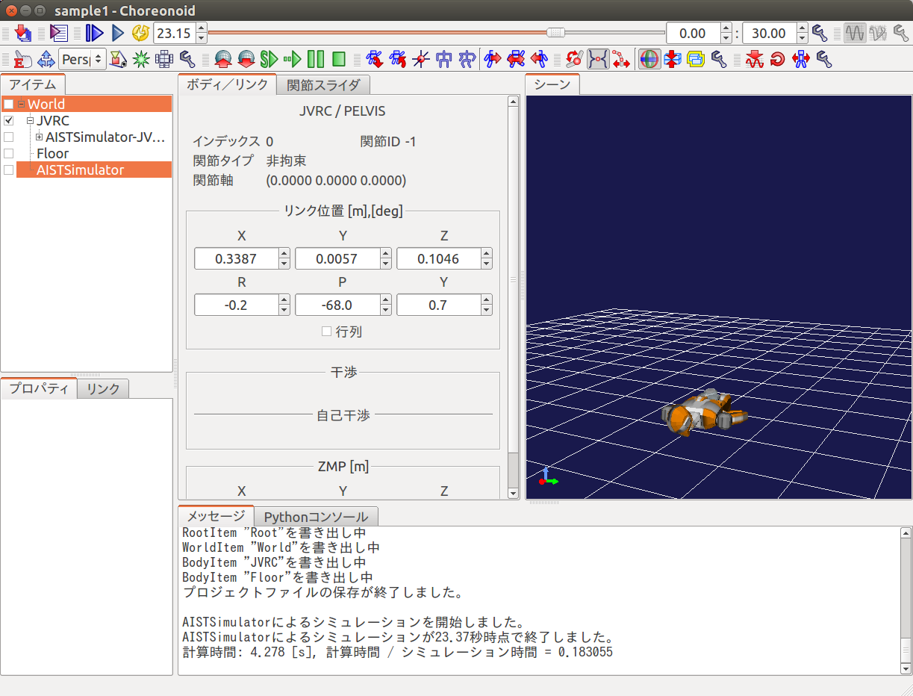

RTコンポーネントにおけるトルク指令の入力
========================================

ここでは、トルク指令を出力するようにRTコンポーネントを拡張し、ロボットが直立を
維持できるようにします。

プロジェクトを開く
------------------

「メニュー」の「プロジェクトの読み込み」から JVRC モデルファイル用のプロジェク
トファイルを読み込みます。プロジェクトファイル名は「モデルファイルのインス
トール」でダウンロードしたリポジトリの「model/robot/samples/sample2.cnoid」です。

コントローラのソースコード
--------------------------

コントローラのソースコードは以下になります。 ::

コントローラのヘッダのソースコードは以下になります。 ::

このソースコードは 「モデルファイルのインストール」でダウンロードしたリポジトリの「model/robot/RTC/RobotControllerTorqueRTC.cpp」と 「model/robot/RTC/RobotControllerTorqueRTC.h」に保存されています。

コントローラのビルド
--------------------

「モデルファイルのインストール」でダウンロードしたリポジトリの「model/robot/RTC/」ディレクトリに移動し、make コマンドを実行します。

「model/robot/RTC/」ディレクトリに「RobotControllerTorqueRTC.so」というファイルが作成されるはずです。

コントローラの設定
------------------

アイテムビューで「BodyRTC」を選択し、プロパティビューの「コントローラのモジュール名」を「RTC/RobotControllerTorqueRTC」とします。これは「コントローラのビルド」で作成したモジュールのパスと対応しています。

シミュレーションを実行する
--------------------------

シミュレーションツールバーの「シミュレーション開始ボタン」を押します。
シミュレーションを実行するとロボットが崩れ落ちず、立ったままの状態になったはずです。

サンプルプロジェクトについて
----------------------------

このサンプルのプロジェクトファイルは「モデルファイルのインストール」でダウン ロードしたリポジトリの「model/robot/samples/sample3.cnoid」に保存されています。

.. toctree::
   :maxdepth: 2

