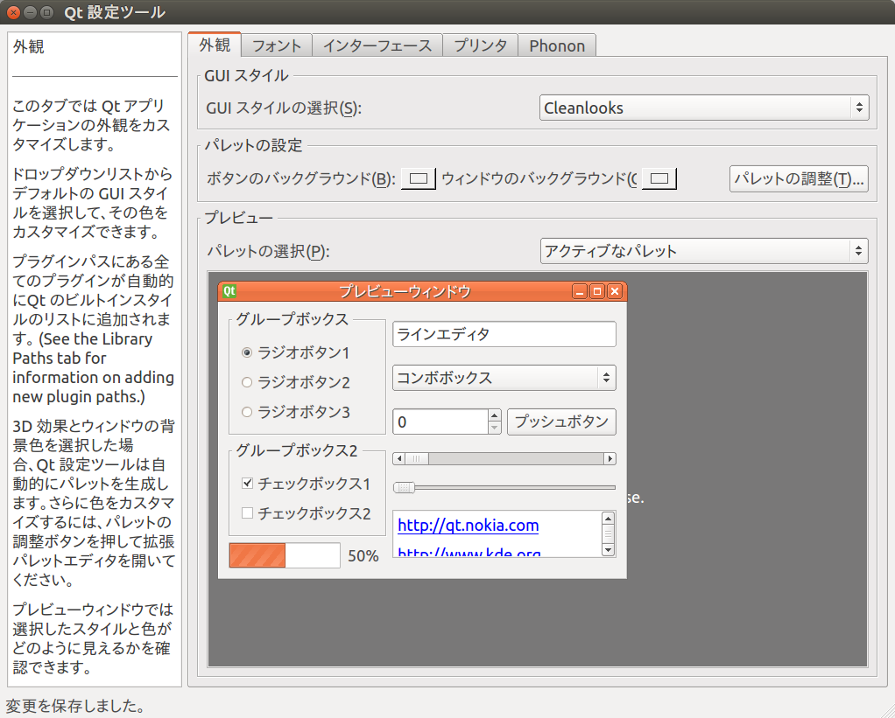
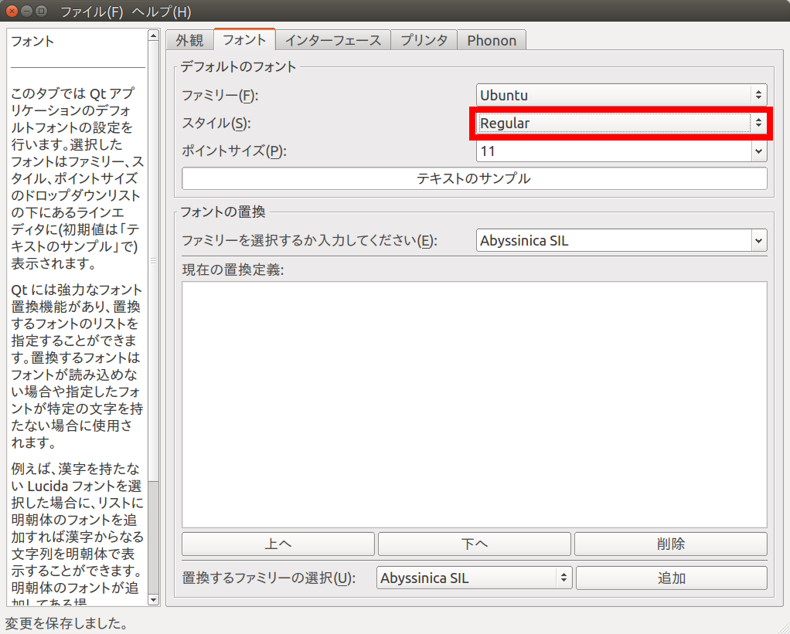
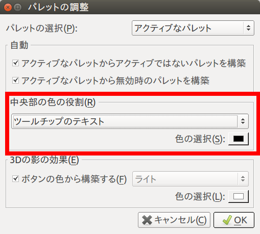

インストール
============

本ドキュメントでは Choreonoid とモデルファイルのインストール方法について解説します。
インストールを実行するのは Ubuntu 14.04 x64 版とします。

Choreonoidのインストール
------------------------

端末上で次のコマンドを実行し、Choreonoid と周辺ツールをインストールします。 ::

 sudo add-apt-repository ppa:hrg/daily
 sudo apt-get update
 sudo apt-get install choreonoid openrtm-aist

モデルファイルのインストール
----------------------------

モデルファイルはgithub上で公開されています。

  https://github.com/jvrc/model

このリポジトリの利用にあたってはgitコマンドが必要です。Ubuntu 環境では以下のコマンドでgitをインストールできます。 ::

 sudo apt-get install git

モデルファイルのリポジトリは以下のコマンドを実行することで取得できます。 ::

 git clone https://github.com/jvrc/model

これによってリポジトリを格納した "model" というディレクトリが生成されます。

Qtスタイルの変更による描画速度の改善
------------------------------------

ChoreonoidはGUIの実装にQtを用いているのですが、Ubuntu Linux のデフォルトでは Qt のスタイルが描画速度を重視しないものになっています。
描画速度を改善するため、以下の手順でスタイルを変更することをお勧めします。

端末から以下のコマンドを実行します。 ::

 qtconfig-qt4

このツール上で、「外観」タブの「GUIスタイル」について、適当な変更を行なってください。このチュートリアルではあらかじめ "Cleanlooks" スタイルに変更しています。

次に、「フォント」タブの「スタイル」を "Regular" に変更します。これを行わないとフォントが太字で表示されてしまいます。

Qt スタイルを "Cleanlooks" スタイルに変更した場合、Choreonoid のツールチップが正常に表示されません。
これを修正するために、「外観」タブの「パレットの調整」から「ツールチップのテキスト」を選択してフォントの色を黒色に変更します。
これでツールチップが正常に表示されるようになります。

最後に、メニューの「ファイル」-「保存」を実行すると、この設定が反映されます。
